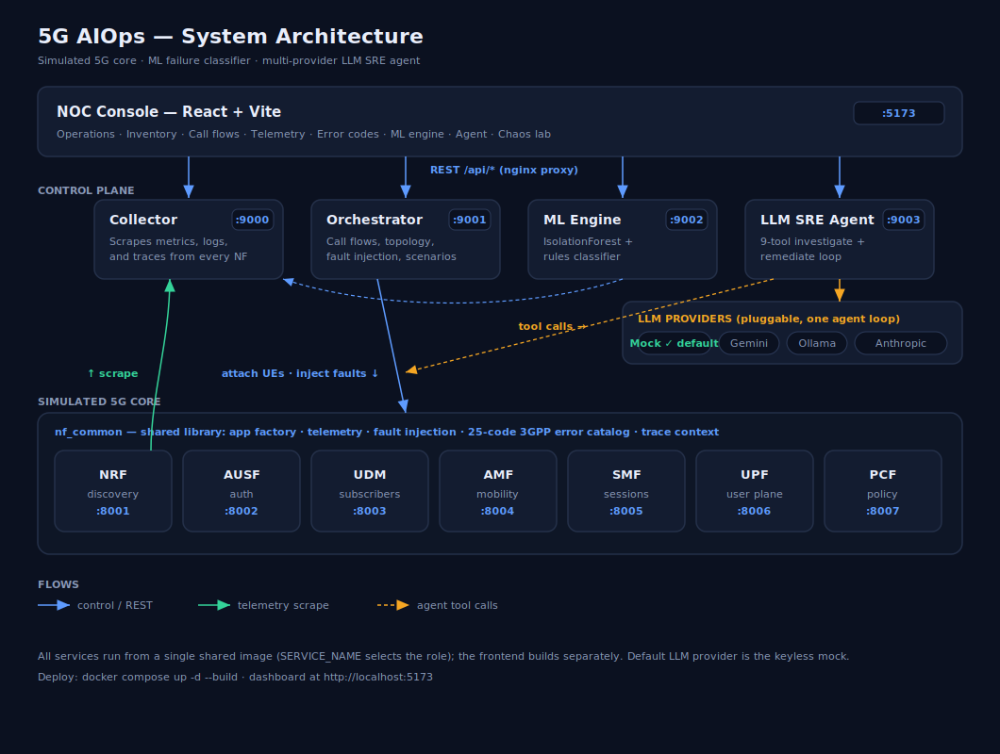

# 5G AIOps

**LLM-powered SRE agent for a simulated 5G core network.**

A microservices implementation of a 5G core (7 NFs) with comprehensive failure injection, ML-based anomaly detection, and an autonomous LLM agent that diagnoses and remediates issues using 9 tools.

[](https://python.org)
[](https://fastapi.tiangolo.com)
[](https://react.dev)
[](https://ai.google.dev)
[](https://docs.docker.com)

---

## Why this exists

Real 5G core networks are operationally complex — dozens of NFs, hundreds of metrics, layered failure modes. AIOps is the discipline of automating "page → diagnose → remediate" with ML and LLMs. This project demonstrates that loop on a realistic-but-simplified 5G core simulator.

**What's interesting:**
- 25 standard 5G error codes (TS 29.500, TS 24.501) emitted as proper `application/problem+json`
- Subscriber state machine that produces semantically meaningful failures
- ML pattern classifier matches error distributions to 8 known scenarios (recommend-only)
- LLM agent with 9 tools that investigates and remediates autonomously
- **4 LLM providers swappable by env var**: Mock (keyless, default), Gemini (free), Ollama (local), Claude (paid) — and the agent auto-falls back to the mock when a provider has no key, so the whole stack runs with **zero configuration**
- Distributed tracing with 5G cause codes shown on red arrows in call flow visualizer

---

## Quick start

### Run locally with Docker (no API key required)

```bash
git clone https://github.com/<your-username>/aiops5g.git
cd aiops5g

# No .env needed — defaults to the keyless mock provider.
docker compose up -d --build
```

Wait ~30 seconds for the build, then open `http://localhost:5173`. The stack
comes up on the **mock** LLM provider, so you can inject scenarios and run the
agent's remediate flow immediately. To use a real model, see
[LLM provider](#llm-provider--four-options) below.

> First run must use `--build` (or `docker compose build`): the 11 backend
> services share one image built by `nrf`, so it has to exist before the
> others start.

### Deploy to a server

**Fedora / RHEL** — see [`deploy/DEPLOY_FEDORA.md`](./deploy/DEPLOY_FEDORA.md), or:

```bash
sudo bash deploy/bootstrap-fedora.sh    # Docker CE, firewalld, systemd unit
sudo systemctl start aiops5g
```

**Ubuntu** — the original [`deploy/bootstrap.sh`](./deploy/bootstrap.sh) +
[`deploy/setup-https.sh`](./deploy/setup-https.sh) add HTTPS for a public domain.
See [`deploy/README.md`](./deploy/README.md) for the comprehensive guide.

---

## Architecture



A React **NOC console** (top-nav sections: Operations, Inventory, Call flows,
Telemetry, Error codes, ML engine, Agent, Chaos lab) talks over a `/api` proxy
to four control-plane services — **Collector** (scrapes metrics/logs/traces),
**Orchestrator** (call flows, fault injection, scenarios), **ML Engine**
(IsolationForest + rules classifier), and the **LLM SRE Agent** (9-tool
investigate/remediate loop, pluggable provider backends). Below them sit the
seven 5G network functions, each a FastAPI service built on the shared
`nf_common` library. All 11 backend services run from **one shared image**
(`SERVICE_NAME` selects the role); the frontend builds separately.

For the full design, see:
- [`docs/HLD.md`](./docs/HLD.md) — high-level design
- [`docs/LLD.md`](./docs/LLD.md) — implementation detail
- [`docs/ARCHITECTURE.md`](./docs/ARCHITECTURE.md) — diagrams
- [`docs/MESSAGE_FLOWS.md`](./docs/MESSAGE_FLOWS.md) — sequence diagrams

---

## LLM provider — four options

| Provider | Cost | Quality | Setup | Notes |
|---|---|---|---|---|
| **Mock** ⭐ default | $0 | Deterministic | None | Keyless SRE playbook — runs the real 9 tools, no LLM call |
| Gemini Flash | $0 | Good | Free key at aistudio.google.com | 1500 req/day free |
| Ollama local | $0 | Decent | Auto-downloads model | Requires ~8 GB RAM |
| Claude Haiku | ~$0.005/run | Best | API key + payment | Cheapest cloud paid option |

The stack ships defaulting to **mock**, so it runs with no configuration. Switch
any time via `.env`:
```bash
LLM_PROVIDER=gemini        # or mock, ollama, anthropic
GEMINI_API_KEY=AIzaSy...   # provider's key
```
Then `docker compose restart llm_agent`. If you set a real provider but leave
its key blank, the agent **falls back to the mock** automatically
(`LLM_FALLBACK_MOCK=0` disables that). The frontend's header chip shows which
provider is live. See [`docs/GEMINI.md`](./docs/GEMINI.md) and
[`docs/OLLAMA.md`](./docs/OLLAMA.md) for provider-specific setup.

---

## What it does

### Network functions (7)

| NF | Port | Role |
|---|---|---|
| NRF | 8001 | Service registry (NF discovery) |
| AUSF | 8002 | 5G-AKA authentication |
| UDM | 8003 | Subscriber DB + state machine |
| AMF | 8004 | UE state, registration coordinator |
| SMF | 8005 | Session management |
| UPF | 8006 | User-plane (simulated KPIs) |
| PCF | 8007 | Policy decisions |

All 7 share `nf_common`: FastAPI scaffolding, failure-injection middleware, 25 5G cause codes, telemetry buffers, SBI client.

### 5G error codes (25 total)

Per 3GPP TS 29.500 (SBI HTTP problem+json) and TS 24.501 (NAS cause):

| Category | Examples |
|---|---|
| Auth | AUTH_REJECTED, MAC_FAILURE, UE_AUTH_KEY_REVOKED |
| Subscription | USER_NOT_FOUND, ROAMING_NOT_ALLOWED, ILLEGAL_UE |
| Session | DNN_NOT_SUPPORTED, INSUFFICIENT_SLICE_RESOURCES |
| Resource | INSUFFICIENT_RESOURCES, NF_CONGESTION |
| Request | MANDATORY_IE_MISSING, INTERNAL_ERROR |

Each is a real `application/problem+json` response with proper HTTP status, NAS cause #, and detail.

### Subscriber state machine (UDM)

| State | Causes UDM to emit |
|---|---|
| ACTIVE | (no error) |
| BLOCKED | ILLEGAL_UE |
| ROAMING_NOT_ALLOWED | ROAMING_NOT_ALLOWED |
| AUTH_KEY_REVOKED | UE_AUTH_KEY_REVOKED (on auth-vector calls only) |
| SUSPENDED | USER_NOT_ALLOWED |
| PROVISIONING_PENDING | SUBSCRIPTION_NOT_FOUND (on profile calls only) |

State persists until explicitly reset. Bulk-set via `POST /api/subscribers/set-state {state, count}`.

### Scenarios (16 scripted)

| Scenario | What it does |
|---|---|
| auth-storm | Throttle UDM, attach 50 UEs simultaneously |
| slow-roast | AUSF latency ramps from 100ms to 5000ms over 60s |
| pdu-collapse | SMF marked unhealthy, no new sessions |
| auth-reject-storm | 50 subscribers AUTH_KEY_REVOKED, attach burst |
| dnn-mismatch | PCF emits DNN_NOT_SUPPORTED 40% of time |
| congestion-cascade | UPF returns INSUFFICIENT_RESOURCES, propagates |
| roaming-restriction | 200 subs in ROAMING_NOT_ALLOWED state |
| slice-capacity-exhausted | SMF rejects 50% with INSUFFICIENT_SLICE_RESOURCES |
| subscription-kaleidoscope | Mixed states across 120 subscribers |
| ... | 7 more |

### ML pattern classifier (recommend-only)

Matches live error code distribution against 8 known patterns. Returns ranked diagnoses with match scores and recommended remediations. Never executes — that's the LLM agent's or operator's job.

### LLM agent — 9 tools

The agent can:
- `read_logs(nf, level, since)` — query log buffer
- `query_metrics(nf)` — get NF metric snapshot
- `get_topology()` — health of all NFs
- `list_failures()` — what's currently injected
- `query_error_codes()` — per-NF 5G cause code counters
- `query_subscriber_states()` — UDM state distribution
- `classify_failure()` — invoke ML classifier
- `clear_failure(nf)` — remediate NF-level injection
- `reset_subscribers()` — remediate subscriber-level state

Same 9 tools work across all four providers (mock/Gemini/Ollama/Anthropic) — each real provider translates them to its native tool-call format; the mock runs them as a fixed SRE playbook.

---

## Demo flow (5 minutes)

The killer demo for portfolio purposes:

1. **Error codes tab → Subscriber State** — set `AUTH_KEY_REVOKED`, count `100`, APPLY
2. **Inventory tab** — attach 80 UEs (many hit blocked subscribers)
3. **Error codes → Live Counters** — `UE_AUTH_KEY_REVOKED: 100+`, `AUTH_REJECTED: 50+`
4. **ML engine tab → Classify** — matches "auth-reject-storm" ~95%
5. **Agent tab → Investigate + remediate** — the agent reads logs, classifies the pattern, calls `reset_subscribers`, and verifies (works on the keyless mock or any real provider)
6. **Operations / Error codes** — counters drain to zero ✓

Total cost: $0 (runs on the mock provider by default).

---

## Project structure

```
aiops5g/
├── docker-compose.yml          # 12 services; 11 backends share one image
├── .env.example                # config template (defaults to keyless mock)
├── QUICKSTART.md               # one-screen getting started
├── deploy/
│   ├── bootstrap-fedora.sh     # one-command Fedora/RHEL → running stack
│   ├── DEPLOY_FEDORA.md        # Fedora/RHEL deployment guide (SELinux, firewalld)
│   ├── bootstrap.sh            # Ubuntu bootstrap
│   ├── setup-https.sh          # nginx + Let's Encrypt
│   └── README.md               # full deployment guide
├── docs/
│   ├── architecture.svg        # system architecture diagram
│   ├── HLD.md                  # high-level design
│   ├── LLD.md                  # implementation detail
│   ├── ARCHITECTURE.md         # diagrams
│   ├── MESSAGE_FLOWS.md        # sequence diagrams
│   ├── GEMINI.md / OLLAMA.md   # provider-specific setup
├── services/
│   ├── nf_common/             # shared library (errors, telemetry, NFClient)
│   ├── nrf, ausf, udm, amf, smf, upf, pcf/  # 7 NF services
│   ├── collector/             # telemetry aggregator
│   ├── orchestrator/          # operator API + scenarios
│   ├── ml_engine/             # anomaly + classifier
│   └── llm_agent/             # multi-provider agent (mock/gemini/ollama/anthropic)
└── frontend/
    └── src/
        ├── App.jsx            # NOC console shell (top nav + live status chips)
        └── components/
            ├── Operations.jsx # landing: KPIs, active injections, activity, inject
            ├── Topology.jsx, Subscribers.jsx, CallFlow.jsx
            ├── Failures.jsx, ErrorCodes.jsx, Scenarios.jsx
            ├── Telemetry.jsx, MLView.jsx, Agent.jsx
            └── ui.jsx
```

---

## Cost summary

| Item | Cost |
|---|---|
| Hetzner CPX11 VPS | $5.18/mo |
| Domain (`.dev` from Cloudflare) | ~$1/mo amortized |
| LLM (mock default, or Gemini free tier) | $0 |
| HTTPS cert (Let's Encrypt) | $0 |
| **Total** | **~$6/mo** |

For comparison:
- Same setup with Claude Haiku: $5 + $1-3 ≈ $6-8/mo
- Same setup with Claude Sonnet: $5 + $20-50 ≈ $25-55/mo
- Render Starter for 12 services: $7 × 12 = $84/mo

---

## What this is NOT

- Not a real 5G core (toy crypto, no NGAP/SCTP, no real radio)
- Not production-ready (no auth, in-memory state, no horizontal scale)
- Not a full AIOps product (no SLO tracking, no notifications, no on-call rotations)

It's a portfolio demonstration of:
- Microservice architecture for telco workloads
- 3GPP-compliant error code handling
- Closed-loop AIOps (detect → diagnose → remediate)
- Multi-provider LLM agent design
- Production-quality deployment (Docker, nginx, HTTPS, systemd)

---

## License

See LICENSE.

---

## Contact

[Kenny Nguyen](https://github.com/kennguyenga)
