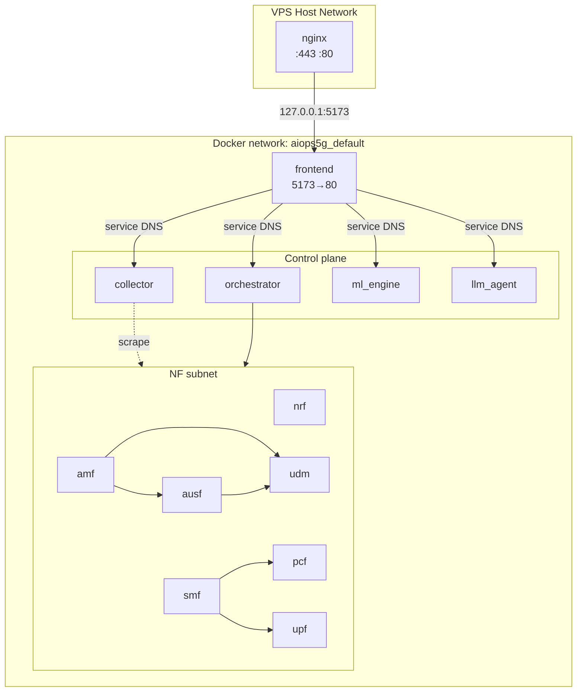
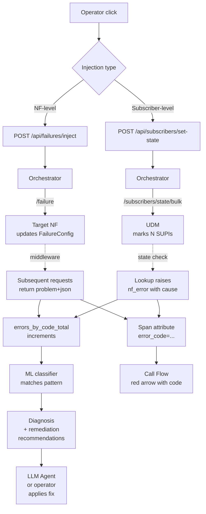
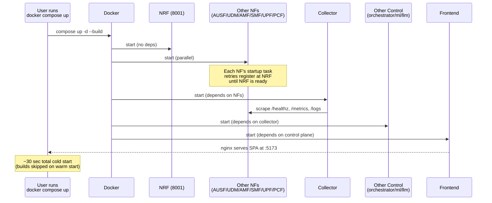

# 5G AIOps — Architecture Diagram

**Version 3.0** · Visual reference for the deployed system.


GitHub renders Mermaid blocks natively. ASCII versions follow each Mermaid diagram for offline viewing.

---

## 1. Top-level deployment view

```mermaid
graph TB
  subgraph Internet
    USER[User Browser]
    GEMINI[Google Gemini API<br/>generativelanguage.googleapis.com]
  end

  subgraph DNS [Cloudflare DNS]
    DNS1[aiops.kennguyen.dev<br/>A record → VPS IP]
  end

  USER -->|HTTPS| DNS1
  DNS1 --> NGINX

  subgraph VPS [Hetzner VPS CPX11 · 2GB RAM · $5/mo]
    NGINX[nginx :443<br/>TLS termination<br/>Let's Encrypt cert]

    subgraph DOCKER [Docker network internal]
      FE[frontend<br/>:80 nginx + React SPA]

      subgraph CTRL [Control Plane]
        ORCH[orchestrator :9001<br/>scenarios, fault injection]
        COLL[collector :9000<br/>logs/metrics/traces]
        ML[ml_engine :9002<br/>anomaly + classifier]
        LLM[llm_agent :9003<br/>multi-provider]
      end

      subgraph NFs [5G Network Functions]
        NRF[nrf :8001]
        AUSF[ausf :8002]
        UDM[udm :8003<br/>subscriber DB]
        AMF[amf :8004]
        SMF[smf :8005]
        UPF[upf :8006]
        PCF[pcf :8007]
      end
    end

    NGINX --> FE
    FE -->|/api proxy| ORCH
    FE --> COLL
    FE --> ML
    FE --> LLM

    COLL -.scrape.-> NRF & AUSF & UDM & AMF & SMF & UPF & PCF
    ORCH --> NRF & AUSF & UDM & AMF & SMF & UPF & PCF
    LLM --> COLL & ORCH & ML & UDM
  end

  LLM -.HTTPS outbound.-> GEMINI

  style VPS fill:#0a1f0a
  style GEMINI fill:#1a1a3a
  style USER fill:#1a1a1a
  style NFs fill:#0d1f1a
  style CTRL fill:#1f1a0a
```



### ASCII fallback

```
                            Internet
                                |
                    ┌───────────┴───────────┐
                    |                       |
                    v                       v
              User Browser            Google Gemini API
                    |                  (over HTTPS)
                    v                       ^
            Cloudflare DNS                  |
       aiops.kennguyen.dev                  |
                    |                       |
                    v                       |
          ╔═════════════════════════════════╪═══════════╗
          ║       Hetzner VPS CPX11 ($5/mo)            ║
          ║                                  |          ║
          ║      nginx :443                  |          ║
          ║   (TLS, Let's Encrypt)           |          ║
          ║          |                       |          ║
          ║          v                       |          ║
          ║   ┌──────────────┐               |          ║
          ║   │  frontend    │               |          ║
          ║   │  React SPA   │               |          ║
          ║   └──────┬───────┘               |          ║
          ║          │ /api proxy            |          ║
          ║          v                       |          ║
          ║   ┌─────────────────────┐        |          ║
          ║   │  Control Plane      │        |          ║
          ║   │  ┌────┐ ┌────┐      │        |          ║
          ║   │  │orch│ │coll│      │        |          ║
          ║   │  └────┘ └────┘      │        |          ║
          ║   │  ┌────┐ ┌─────────┐ │        |          ║
          ║   │  │ ml │ │llm_agent├─┼────────┘          ║
          ║   │  └────┘ └─────────┘ │                   ║
          ║   └─────────────────────┘                   ║
          ║          |                                  ║
          ║          v                                  ║
          ║   ┌────────────────────────────┐            ║
          ║   │  5G NF Layer (7 services)  │            ║
          ║   │  NRF AUSF UDM AMF SMF UPF PCF           ║
          ║   └────────────────────────────┘            ║
          ╚═════════════════════════════════════════════╝
```

---

## 2. Component dependencies

```mermaid
graph LR
  FE[Frontend SPA] --> ORCH
  FE --> COLL
  FE --> ML
  FE --> LLM

  ORCH[Orchestrator] --> NRF & AUSF & UDM & AMF & SMF & UPF & PCF
  COLL[Collector] -.scrapes.-> NRF & AUSF & UDM & AMF & SMF & UPF & PCF

  LLM[LLM Agent] --> COLL
  LLM --> ORCH
  LLM --> ML
  LLM --> UDM

  ML[ML Engine] --> COLL

  AMF --> AUSF & UDM & SMF
  AUSF --> UDM
  SMF --> PCF & UPF

  NRF[NRF :8001]
  AUSF[AUSF :8002]
  UDM[UDM :8003]
  AMF[AMF :8004]
  SMF[SMF :8005]
  UPF[UPF :8006]
  PCF[PCF :8007]

  classDef nf fill:#0d2a1d
  classDef ctl fill:#2a1f0d
  classDef fe fill:#1a1a3a

  class NRF,AUSF,UDM,AMF,SMF,UPF,PCF nf
  class ORCH,COLL,LLM,ML ctl
  class FE fe
```



---

## 3. LLM Agent provider abstraction

```mermaid
graph TB
  HTTP[POST /api/llm/remediate] --> EFF{_effective_provider}
  EFF -->|no key + fallback| MOCK_LOOP[Mock Loop<br/>deterministic<br/>SRE playbook]
  EFF -->|LLM_PROVIDER| DISP{provider}

  DISP -->|mock| MOCK_LOOP
  DISP -->|gemini| GEM_LOOP[Gemini Loop<br/>functionDeclarations<br/>functionResponse]
  DISP -->|ollama| OLL_LOOP[Ollama Loop<br/>OpenAI-compat<br/>tool_calls]
  DISP -->|anthropic| ANT_LOOP[Anthropic Loop<br/>tool_use blocks]

  GEM_LOOP -->|HTTPS| GEM[generativelanguage.<br/>googleapis.com]
  OLL_LOOP -->|local HTTP| OLL[ollama:11434<br/>only if --profile ollama]
  ANT_LOOP -->|HTTPS| ANT[api.anthropic.com]

  MOCK_LOOP & GEM_LOOP & OLL_LOOP & ANT_LOOP --> EXEC[_execute_tool<br/>9 tools]

  EXEC --> COLL[collector]
  EXEC --> ORCH[orchestrator]
  EXEC --> UDM[udm]
  EXEC --> ML2[ml_engine]

  MOCK_LOOP & GEM_LOOP & OLL_LOOP & ANT_LOOP -.canonical transcript.-> RESP[JSON response<br/>same shape all providers]

  classDef provider fill:#1a3a2a
  classDef external fill:#3a1a1a
  class MOCK_LOOP,GEM_LOOP,OLL_LOOP,ANT_LOOP provider
  class GEM,OLL,ANT external
```



### Why this matters

The frontend renders the same UI regardless of provider. Each loop converts to/from the canonical Anthropic-style transcript shape, so the only thing that differs is the underlying API call. `_effective_provider()` resolves the active backend: it returns `mock` when `LLM_PROVIDER=mock`, **or** automatically when the selected provider has no credentials (unless `LLM_FALLBACK_MOCK=0`). The **mock** backend needs no key — it runs the same 9 tools as a deterministic investigate→classify→remediate→verify playbook, so the stack demos end-to-end with zero configuration.

### ASCII fallback

```
            _effective_provider()
                    │
     ┌──────┬───────┼───────────┐
     v      v       v           v
  [mock] [gemini] [ollama]  [anthropic]
     │      │       │           │
     v      v       v           v
 playbook Gemini  Ollama     Claude API
 (keyless) API    API        (paid, cloud)
     │      │       │           │
     └──────┴───────┼───────────┘
                    v
            _execute_tool
            (9 tools, identical
             across providers)
```

---

## 4. Container layout (default — no Ollama)



When `LLM_PROVIDER=mock` (default), no external LLM is contacted at all, and the `ollama` and `ollama_init` containers DO NOT run. They're behind a Docker Compose profile and only start with `docker compose --profile ollama up`. All 11 backend services run from a single image (`aiops5g-core:latest`, built once by `nrf`); `SERVICE_NAME` selects the role at runtime.

---

## 5. Failure injection paths



---

## 6. Stack-up sequence (boot order)



---

## 7. Network function call paths

The 7 NFs communicate over HTTP-based SBI. Key paths:

| From | To | Endpoint | When |
|---|---|---|---|
| AMF | NRF | GET /nf-instances?type=AUSF | Discovery on attach |
| AMF | AUSF | POST /authentications | UE attach auth |
| AUSF | UDM | POST /subscribers/{supi}/auth-vector | Get challenge |
| AMF | UDM | GET /subscribers/{supi}/profile | After auth, get profile |
| AMF | SMF | POST /pdu-sessions | After registration |
| SMF | PCF | POST /policies | Policy decision |
| SMF | UPF | POST /pdu-sessions/{id}/bearers | Install bearer |
| All NFs | NRF | POST /nf-instances | Periodic heartbeat |

All these calls go through `NFClient` in nf_common, which adds:
- Trace context propagation (X-Trace-Id, X-Parent-Span-Id headers)
- Span emission to local telemetry buffer
- Error code extraction from problem+json response bodies
- Span attribute `error_code` set on failures (so call flow visualizer can show it)

---

## 8. Frontend structure (NOC console)

```mermaid
graph LR
  APP[App.jsx] --> NAV[Top Nav + status chips]
  NAV --> T1[Operations]
  T1 --> O1[Overview]
  T1 --> O2[Topology]
  NAV --> T2[Inventory]
  NAV --> T3[Call flows]
  NAV --> T7[Telemetry]
  NAV --> T5[Error codes]
  NAV --> T8[ML engine]
  NAV --> T9[Agent]
  NAV --> T4[Chaos lab]
  T4 --> C1[Inject]
  T4 --> C2[Scenarios]

  O1 -.uses.-> ORCH[/api/orchestrator/]
  O1 -.uses.-> COLL[/api/collector/]
  O2 -.uses.-> ORCH
  T2 -.uses.-> ORCH
  T3 -.uses.-> COLL
  T5 -.uses.-> COLL
  T5 -.uses.-> ML_API[/api/ml/classify-failure]
  T7 -.uses.-> COLL
  T8 -.uses.-> ML_API
  T9 -.uses.-> LLM_API[/api/llm/]
  NAV -.chips.-> LLM_API
```

The shell renders a header with live status chips (LLM provider, Core health, Telemetry, Errors/5m — each backed by a real endpoint) and a horizontal nav. **Operations** is the landing view (KPIs, active injections, recent activity, inject-scenario sidebar). All eleven feature components share design tokens, so the theme is consistent.

---

## 9. Files this diagram references

For the actual code:
- Container definitions: [`docker-compose.yml`](../docker-compose.yml)
- nginx public config: generated by [`deploy/setup-https.sh`](../deploy/setup-https.sh)
- nginx /api proxy (in frontend container): `frontend/nginx.conf`
- Per-NF logic: `services/<nf>/main.py`
- Shared NF library: `services/nf_common/__init__.py`
- LLM agent: `services/llm_agent/main.py`
- Frontend tabs: `frontend/src/components/`
