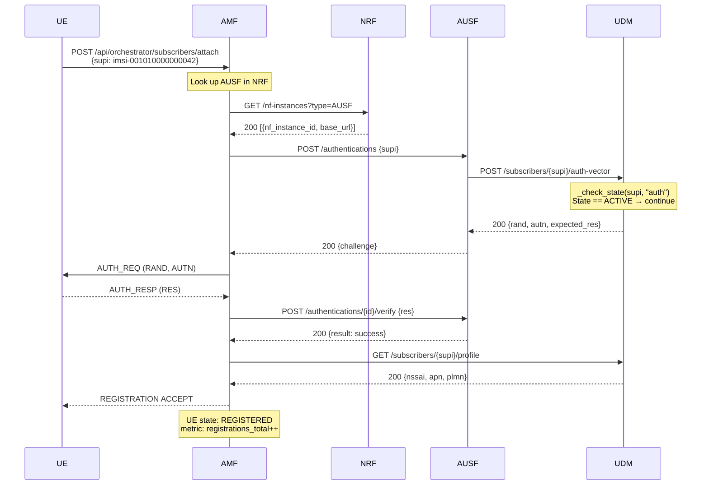
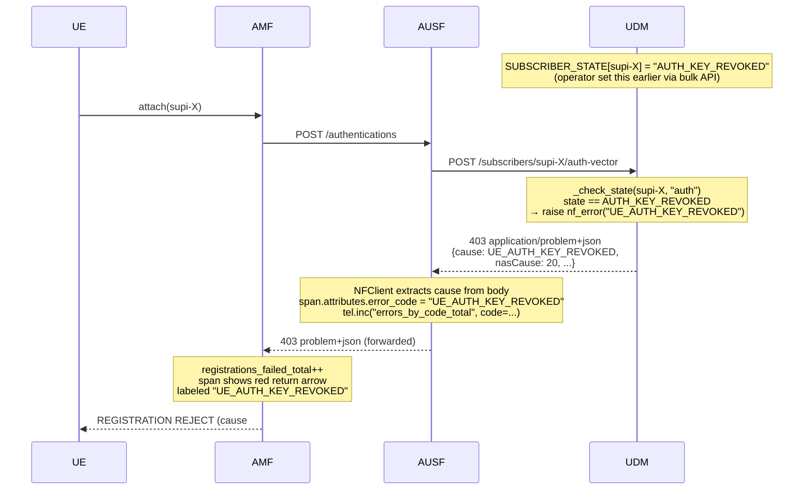
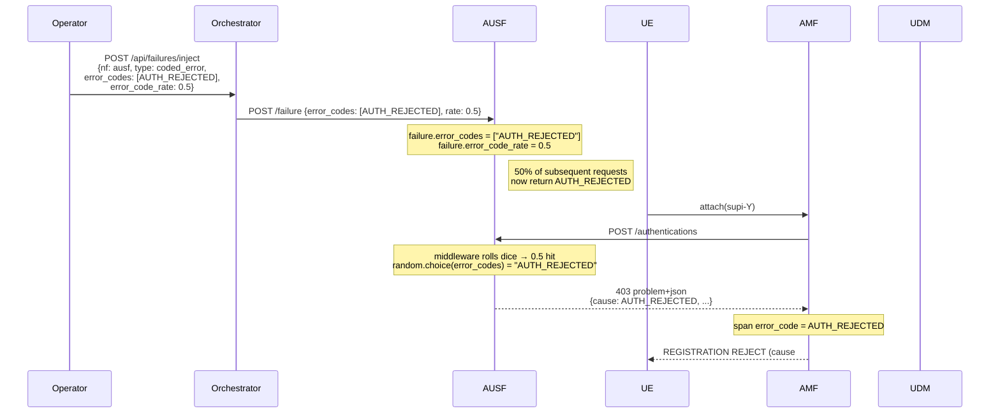
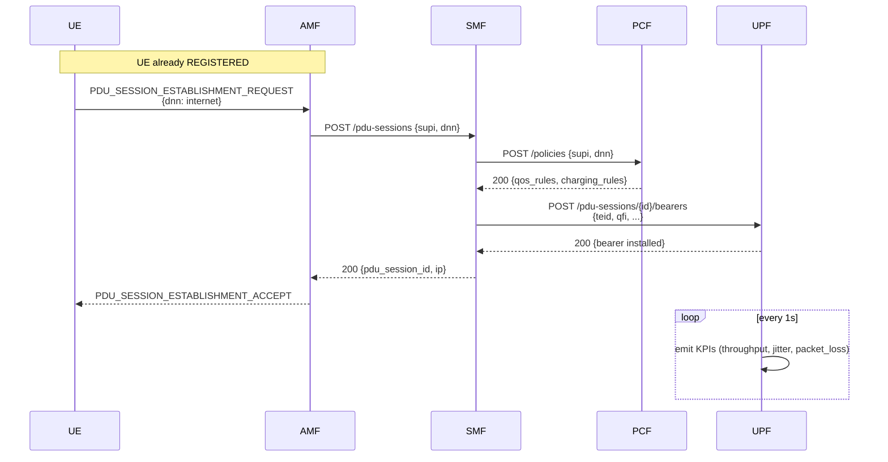
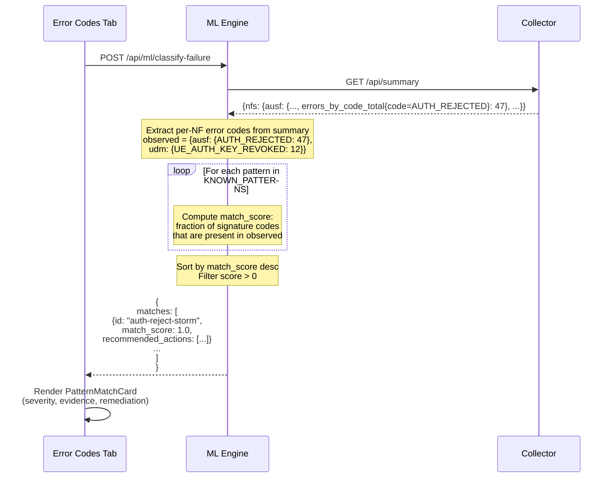
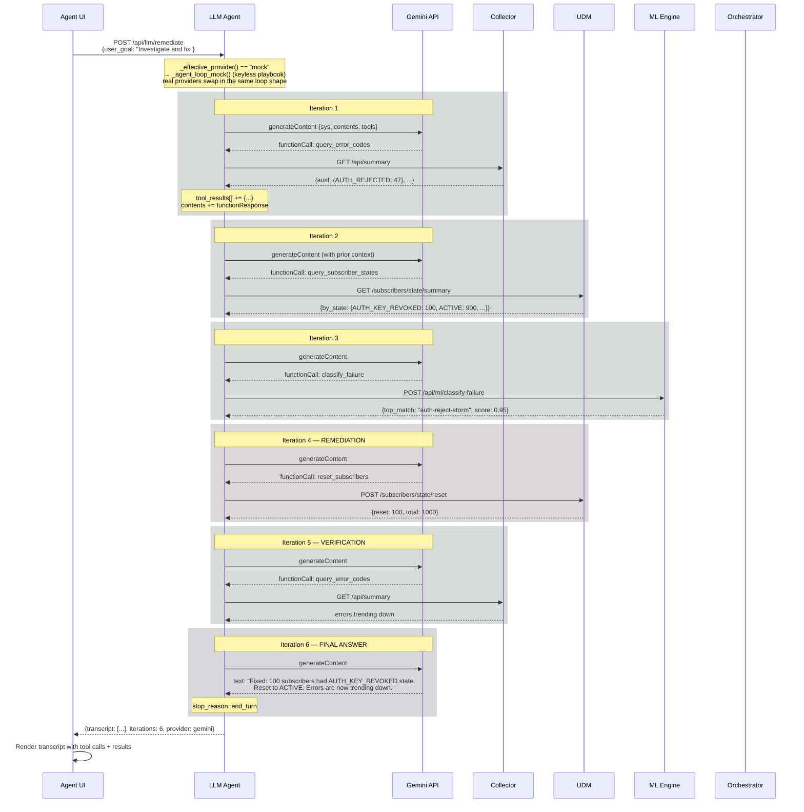
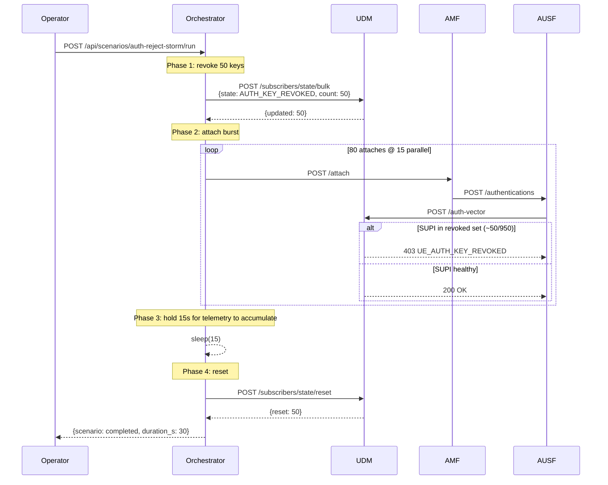
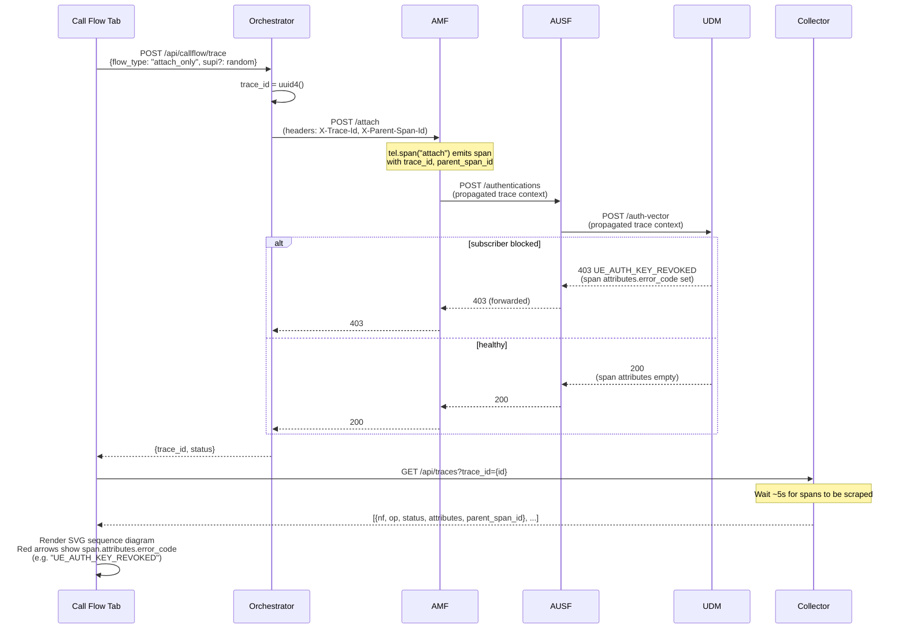
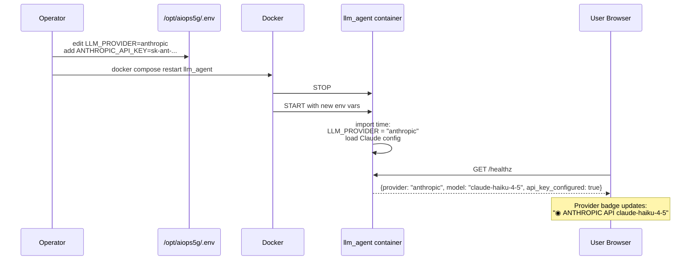
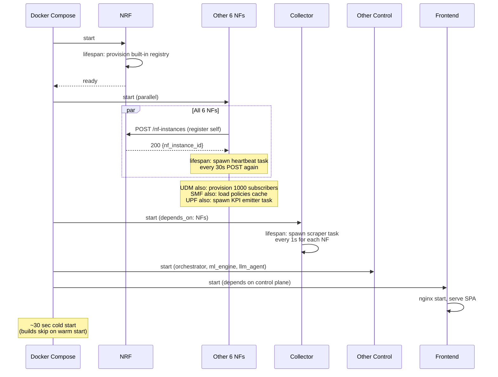

# 5G AIOps — Message Flows

**Version 2.0** · Sequence diagrams for the major workflows.

GitHub renders Mermaid blocks natively. ASCII fallback follows each.

---

## 1. UE Registration (happy path)



---

## 2. UE Registration with subscriber-level failure (AUTH_KEY_REVOKED)



---

## 3. UE Registration with NF-level coded error (AUTH_REJECTED)



---

## 4. PDU Session Establishment (happy path)



---

## 5. ML Classifier diagnosis flow



---

## 6. LLM Agent autonomous remediation (mock provider — default)



### Total cost on Gemini Flash free tier

```
6 iterations × ~1500 tokens avg = 9000 tokens
Free tier limit: 1,000,000 tokens/min, 1500 requests/day
This run: 6 requests, 9k tokens → well within limits
Cost: $0
```

### ASCII fallback (Gemini agent loop)

```
┌──────┐    ┌─────────┐    ┌──────────┐    ┌─────┐
│ User │    │   LLM   │    │  Gemini  │    │ NFs │
└──┬───┘    └────┬────┘    └────┬─────┘    └──┬──┘
   │             │              │             │
   │ remediate   │              │             │
   ├────────────>│              │             │
   │             │  generateContent           │
   │             ├─────────────>│             │
   │             │              │             │
   │             │<─query_error_codes call    │
   │             │              │             │
   │             ├──── GET /api/summary ──────┼──>│
   │             │              │             │  │
   │             │<───── { error counts } ────┼──┤
   │             │              │             │
   │             │  generateContent (turn 2)  │
   │             ├─────────────>│             │
   │             │              │             │
   │             │  ... 5 more iterations ... │
   │             │              │             │
   │             │<──── final answer text ────┤
   │<── transcript ──────────────────────────┤
```

---

## 7. Multi-step scenario execution (auth-reject-storm)



This scenario is what the LLM agent then has to diagnose. The expected ML match is "auth-reject-storm" with high confidence.

---

## 8. Call Flow trace generation



---

## 9. Provider switching (Gemini → Anthropic)

This is an operational flow, not a runtime one:



The frontend does not need to redeploy — it just polls `/api/llm/healthz` and updates the badge.

---

## 10. Cold-start sequence



---

## 11. Summary of message-flow concepts

| Concept | Where it lives in the code |
|---|---|
| Inter-NF SBI calls | `nf_common.NFClient.call()` |
| Trace context propagation | X-Trace-Id, X-Parent-Span-Id headers (NFClient adds them) |
| Span emission | `Telemetry.span()` async context manager |
| Error code on red arrows | `span.attributes["error_code"]` (set by NFClient on 4xx/5xx) |
| Subscriber state checks | `udm.main._check_state(supi, lookup_kind)` |
| Coded error injection | `nf_common.middleware` lines 270-290 |
| ML pattern matching | `ml_engine.main.KNOWN_PATTERNS` + `_match_pattern()` |
| LLM provider dispatch | `llm_agent.main.remediate()` lines 350-360 |
| Gemini agent loop | `llm_agent.main._agent_loop_gemini()` |
| Tool execution | `llm_agent.main._execute_tool()` |
